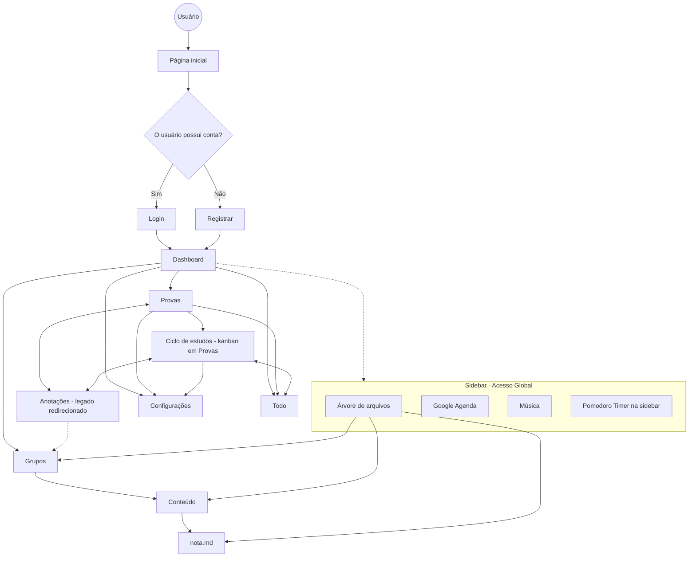

```mermaid
flowchart TD

    usuario((Usuário))
    home[Página inicial]
    login[Login]
    registrar[Registrar]
    dashboard[Dashboard]
    grupos[Grupos]
    conteudo[Conteúdo]
    arquivo[nota.md]
    provas[Provas]
    anotacoes[Anotações - legado redirecionado]
    config[Configurações]
    ciclo[Ciclo de estudos - kanban em Provas]
    todo[Todo]

    usuario --> home
    home --> auth{O usuário possui conta?}
    auth -->|Sim| login
    auth -->|Não| registrar

    login --> dashboard
    registrar --> dashboard

    dashboard --> grupos
    grupos --> conteudo
    conteudo --> arquivo
    anotacoes -.-> grupos
    dashboard --> provas
    dashboard --> config
    dashboard --> todo

    provas --> ciclo
    provas --> config
    provas --> todo
    provas <--> anotacoes

    ciclo <--> anotacoes
    ciclo <--> todo
    ciclo --> config


    subgraph Sidebar [Sidebar - Acesso Global]
        direction LR
        arvore[Árvore de arquivos]
        agenda[Google Agenda]
        musica[Música]
        pomodoro[Pomodoro Timer na sidebar]
    end

    dashboard -.-> Sidebar
    arvore --> grupos
    arvore --> conteudo
    arvore --> arquivo
```
